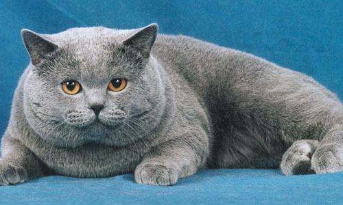
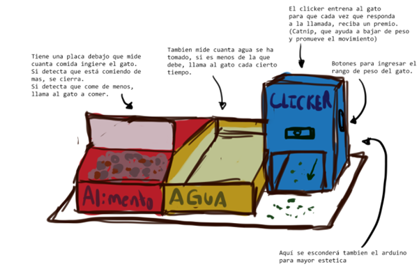
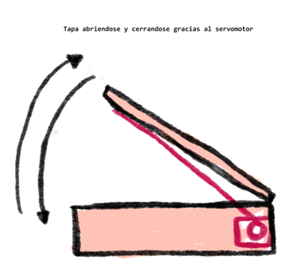
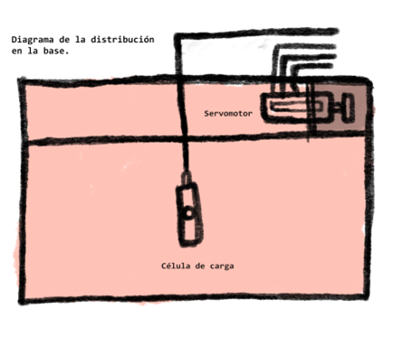
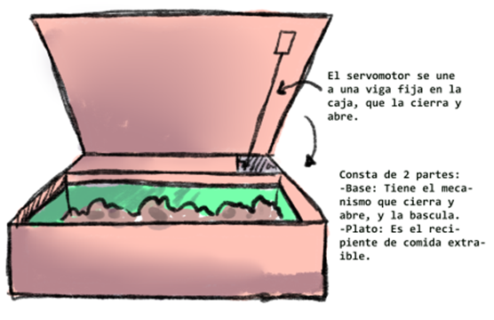
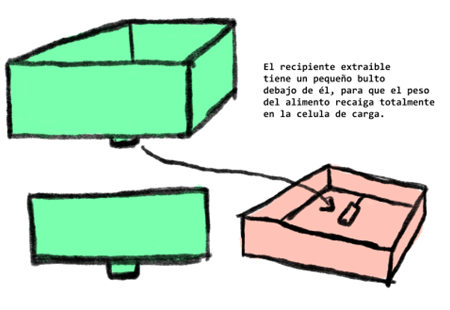
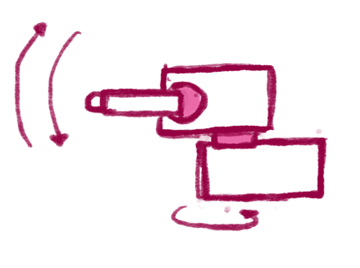

# 
 🐈 CatFit 🐈‍⬛ 

### 
 Proyecto C.I.
   

  

  

## **Objetivo** 🎯
---
Entrenar, habituar y orientar al gato a formar hábitos alimenticios correctos y fomentar la actividad física. Así evitándose enfermedades y afecciones relacionadas con el sobrepeso.  

## **Qué es** 🤖
---
**Sistema entrenador** automático de hábitos alimenticios y **promotor de actividad física** para la prevención del sobrepeso en gatos.

Clicker automático aunado a un comedor y a un laser.   

## **Qué hace** 🎛️
---

**Maneja y lleva un control** de la alimentación como la actividad física del gato. **Se asegura** de que no se alimente más; y **hace** que la mascota se ejercite y juegue, **gracias al estímulo de recompensa**.      
Así cumple con su función de inculcar y cultivar hábitos en la mascota.  

**El "clicker" se activa todos los días a las mismas horas** y lo invita a jugar; a comer y **si se excede, no lo deja comer más**.  

## **CatFit consta de tres partes principales 🧩** 
---

* **Clicker.**  
Emite un sonido con un speaker y cuando responde al estímulo, proporciona un premio. Esto para recordarle tomar comer y realizar su actividad física. Se activa también si el gato no ha cumplido con su dosis.
Entrenador "ruido-recompensa". 
Además, bajo él está el contenedor de catnip que dispensa los premios y caen por una rampa hecha con material rascador.   
Reproducirá dos sonidos diferentes dependiendo de la actividad.
  

* **Comedor.**  
Tienen una célula de carga con función de bascula para calcular los alimentos que ha ingerido. Tiene una bisagra que cierra cuando el gato ha comido >= de porción de sus alimentos establecida.       

* **Puntero.**  
Promueve el ejercicio con el láser y se mueve de forma automática junto con el sensor de movimiento. Cuenta con dos servomotores que hacen que se mueva.  
Si responde al llamado, se premia después del tiempo de ejercicio.  

## **Alimentación 🐠**
---
El Clicker sonará cinco veces al día para recordarle al gato que tiene que comer. La porción completa se sirve durante todo el día y el gato es libre de dosificar sus tiempos de comida. 

Horarios:

- 8 hrs     
- 12 hrs
- 16 hrs
- 20 hrs
- 23 hrs  

 

Si el gato ya comió su porción completa, la bascula marcará 0, entonces, de todas maneras se dispensa un catnip por haber respondido al llamado.

La cantidad de comida dependiendo del peso del gato se encuentra en esta tabla:

| Peso  | Comida |
| ----- | ------ |
| 2kg   | 30-40g |
| 3kg   | 40-55g |
| 4kg   | 45-65g |
| 5kg   | 55-75g |
| +6kg  | 11g*kg|

 

Algoritmo de la alimentación:

1. Hacer sonar el Clicker para llamar al gato
2. Que la bascula empiece a contabilizar la cantidad de alimento que está siendo ingerido (algo así como el principio de Archimedes)
3. Si después de un minuto, ya no se está consumiendo comida, dar el catnip
5. Inicializar temporizador
6. Volver al paso 1

 

## **Ejercitación 🏋️**
---
El Clicker sonará seis veces al día para recordarle al gato que es hora de ejercitarse.
El tiempo total que tiene que realizar el gato al día es media hora y esto se va a repartir en sesiones de 5 minutos cada una. 

Horarios:

* 9 hrs
* 11 hrs
* 13 hrs
* 17 hrs
* 19 hrs
* 22 hrs

 

Algoritmo de la ejercitación:

1. Hacer sonar el Clicker para llamar al gato
2. Activar el sensor
3. Si se detecta el gato antes de diez segundos, dispensar catnip al final de los cinco minutos
4. De lo contrario, volver al paso 1
5. Volver al paso 1
  

## 🔍 **Observaciones / recomendaciones**
---
* Si el gato ya comió su porción completa, la bascula marcará 0, entonces, de todas maneras se dispensa un catnip por haber respondido al llamado.
* Que el sensor del laser solo lo detecte una vez al gato.
  

## ❓ **Preguntas**
---
- [ ] ¿se guarda la cantidad de alimentos ingeridos al día en alguna base de datos?
  

## 🖼️ **Galería**
---

